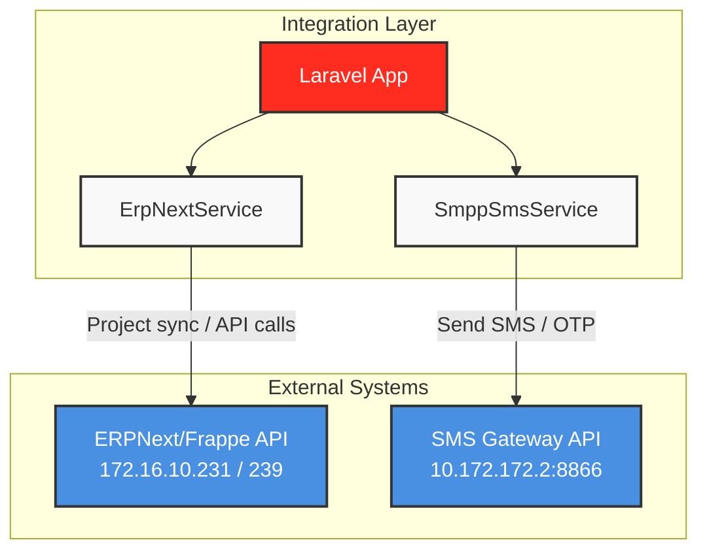

# Integration Architecture

## Overview
The Laravel application serves as the central **Integration Layer** connecting multiple disparate external systems. The architecture enforces strict separation of concerns, ensuring that external systems do not communicate with each other directly and are completely unaware of one another.

### Separation of Concerns
1. **ERPNext Integration**: Handled exclusively by `ErpNextService.php`.
2. **SMS Gateway Integration**: Handled exclusively by `SmppSmsService.php`.

## Architecture Diagram

## System Rules
- **No Direct Communication**: ERPNext does not send SMS. SMS Gateway does not know about ERPNext. There is no API bridge between ERPNext and the SMS Gateway.
- **Service Isolation**: Each external system has a dedicated integration service within Laravel.
- **Troubleshooting Isolation**:
    - SMS issues should ONLY be traced within `config/sms.php`, SMPP variables in `.env`, and `SmppSmsService.php`.
    - ERPNext issues should ONLY be traced within `ErpNextService.php` and ERP variables in `.env`.
    - Modifying one service's configuration to fix the other is strictly prohibited.
